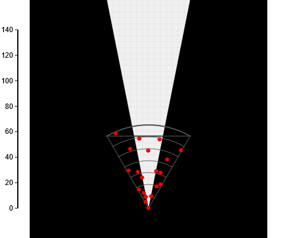
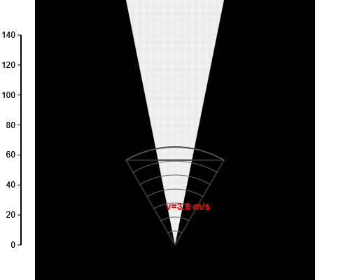

# Radar-Camera Fusion Object Detection System

This project implements a real-time radar-camera fusion system for robust object detection in complex environments. It leverages YOLOv8 for visual inference, with CUDA-accelerated pre- and post-processing and TensorRT-based deployment for high-performance execution. By fusing complementary data from radar and camera sensors, the system significantly improves perception accuracy and reliability under diverse conditions.

---

## ✨ Key Features

* **Radar-Camera Sensor Fusion**
* **YOLOv8-Based Detection**
* **C++17 Implementation**
* **Modular Design**
* **Visual Output Support**

---

## 📁 Project Structure

```
radar_image/
├── config/              
├── include/             
├── msgs/                
├── src/                 
├── ultralytics-8.0.40/  
├── workspace/              
├── CMakeLists.txt       
└── README.md            
```

---

## 🔧 Build Dependencies

* C++ compiler with **C++17** support (e.g., `g++ >= 7`)
* CMake ≥ 3.10
* OpenCV ≥ 4.0
* jsoncpp
* Protobuf ≥ 3.0

---

## ⚙️ Build & Run

```bash
mkdir build
cd build
cmake .. -DCMAKE_CXX_STANDARD=17
make -j$(nproc)
./yolo_refactor
```

---

## 🧪 Filtering Visualization

The following visual examples show detection results **before** and **after** the radar-camera fusion filtering process:

### Before Filtering

<!-- Replace with actual path -->



### After Filtering

<!-- Replace with actual path -->




## 🙏 Acknowledgements

This project makes use of the following open-source resources:

* [shouxieai/infer](https://github.com/shouxieai/infer)
* [ultralytics/ultralytics](https://github.com/ultralytics/ultralytics)


